# Graphics Project: Egyptian Pyramid Adventure

An OpenGL-based computer graphics project featuring an explorable pyramid environment with dynamic lighting, shader-based effects, procedural elements, and multiple camera modes.

## Demo Video

- YouTube: [Project Demo](https://youtu.be/D0a7_3nvW84)
- Direct preview link: https://youtu.be/D0a7_3nvW84

## Screenshots

### Logo


### Gallery

| 1 | 2 | 3 | 4 |
|---|---|---|---|
| 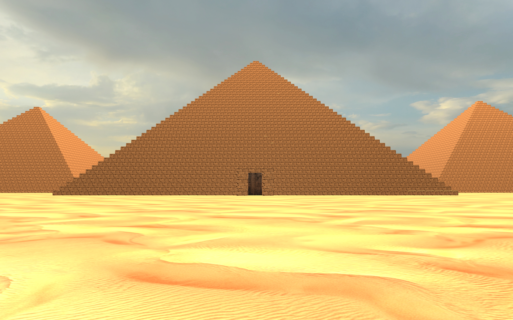 | 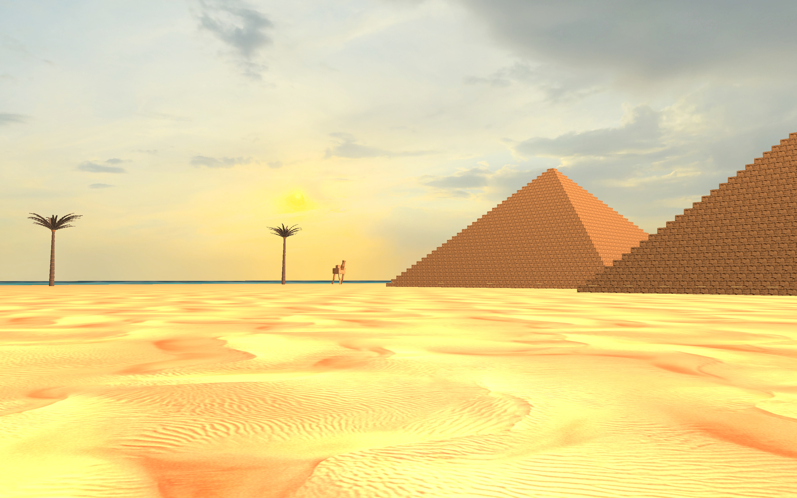 | 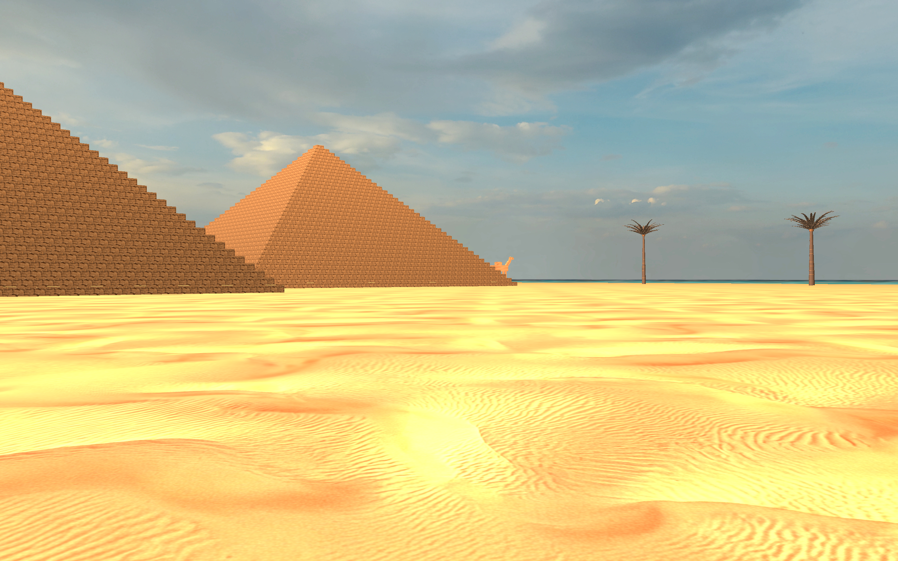 | 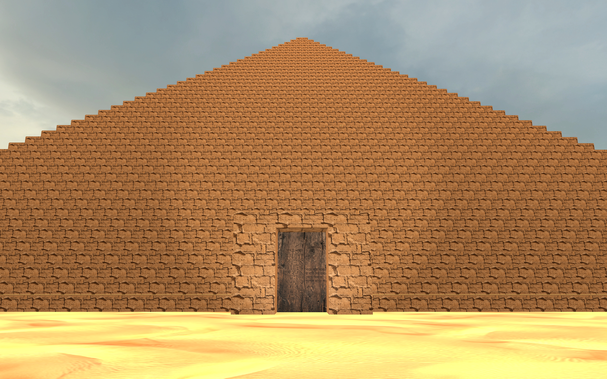 |
| 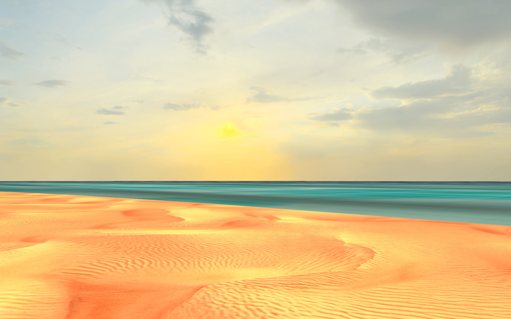 | 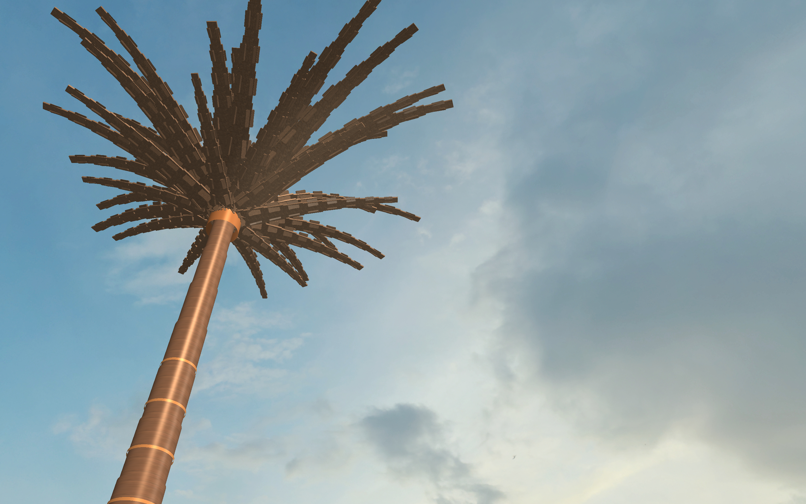 | 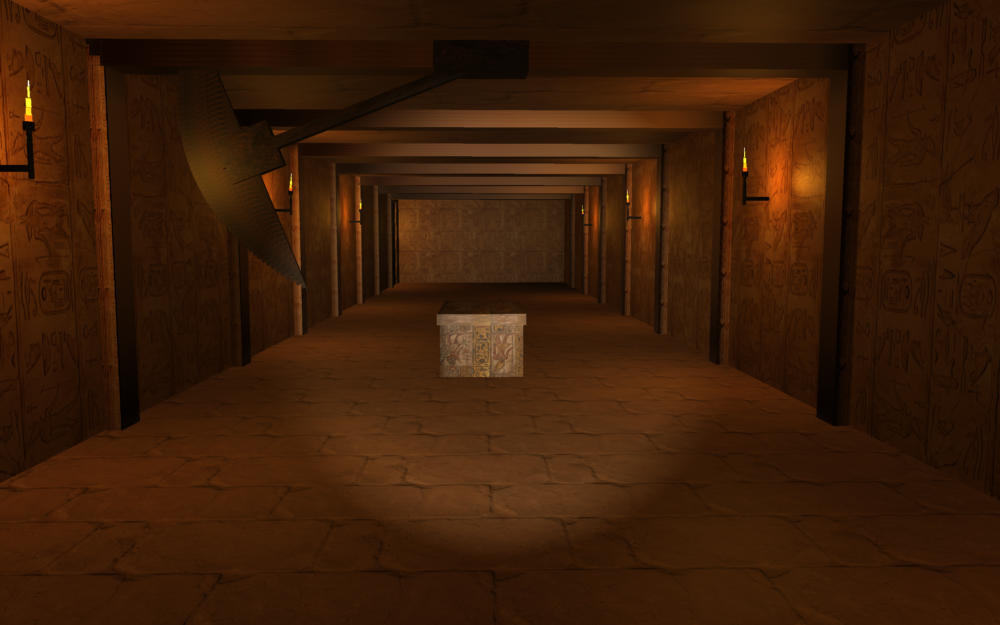 | 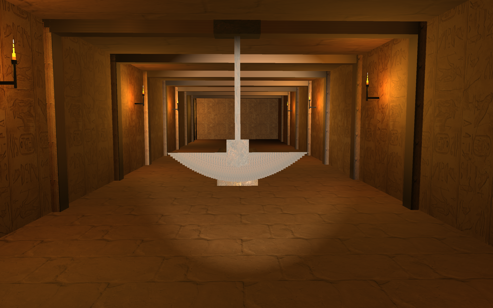 |
| 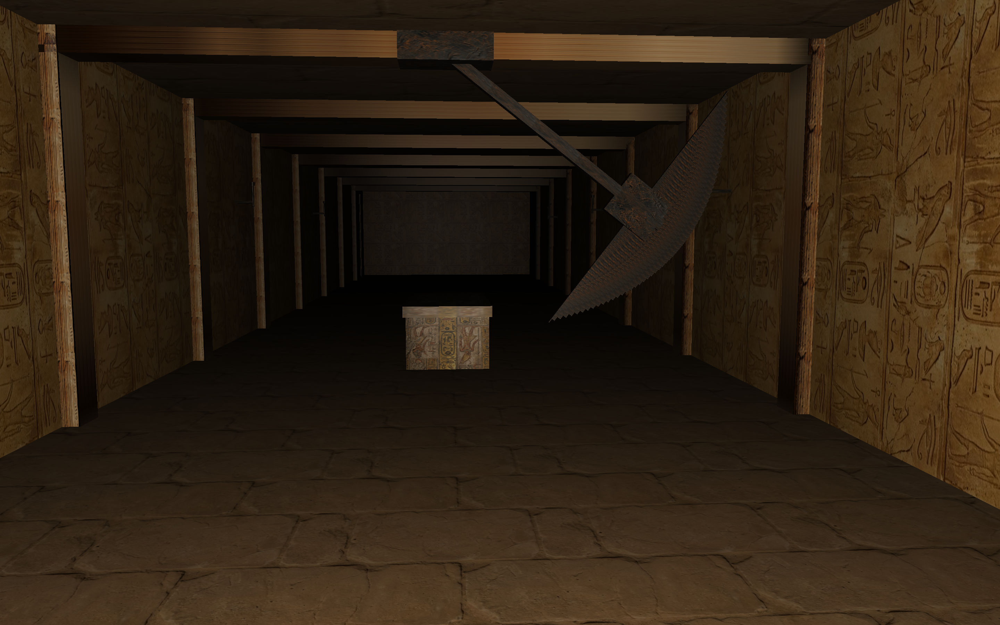 | 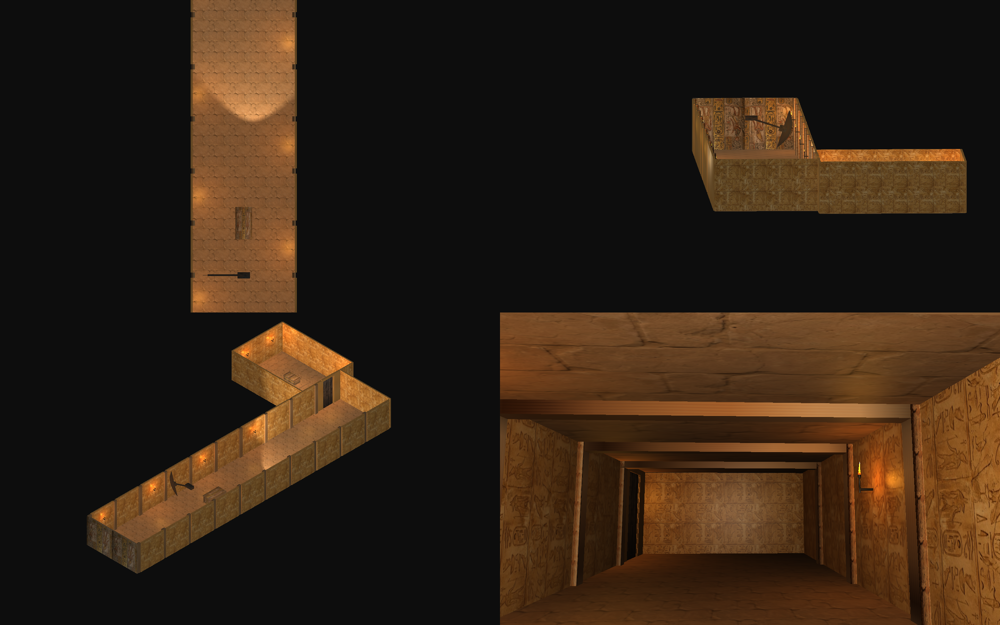 | 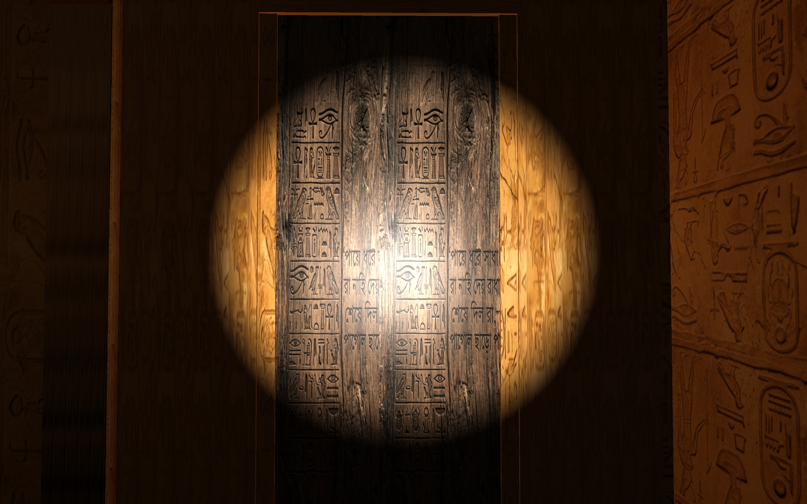 | 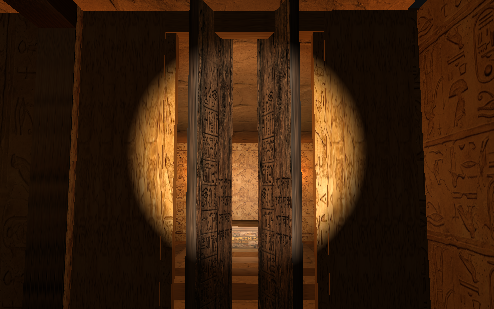 |
| 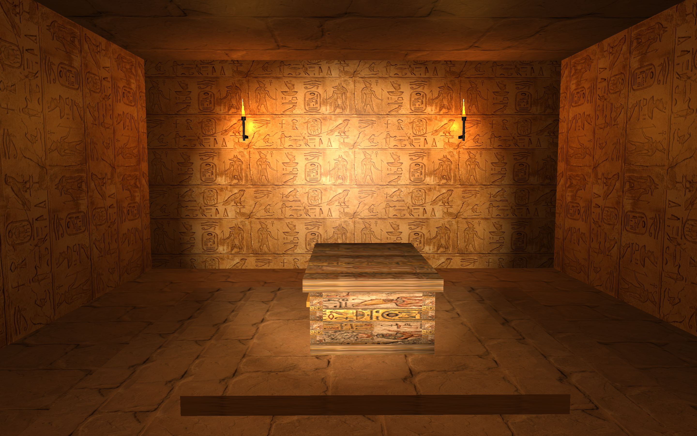 | 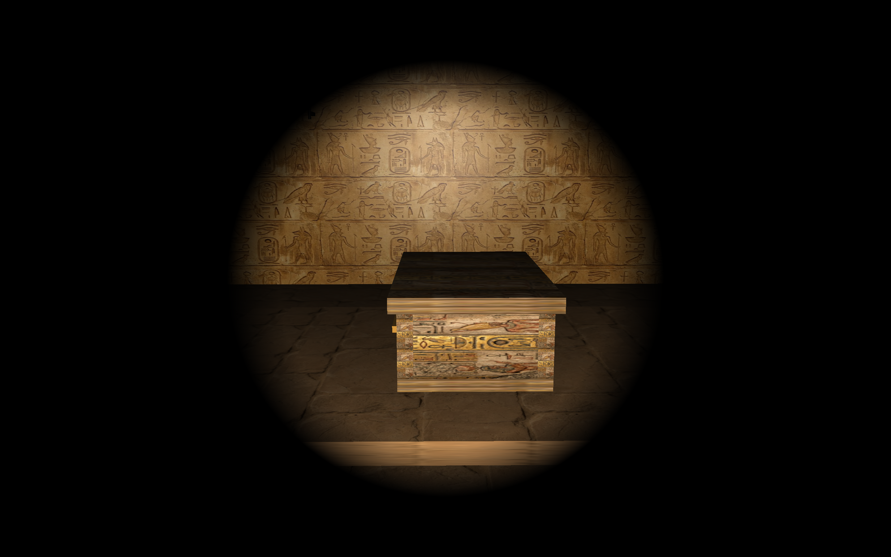 | 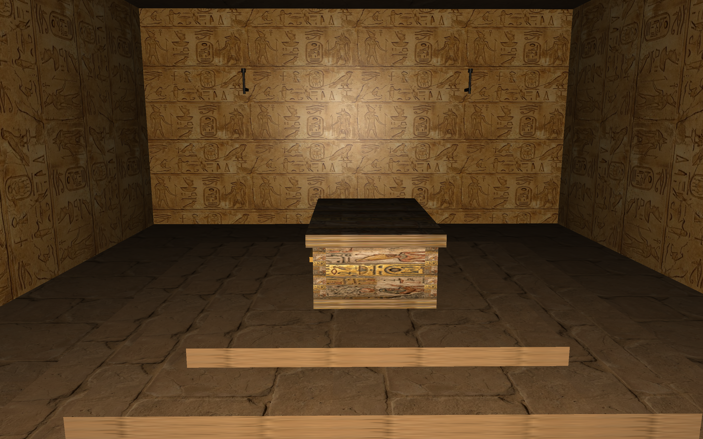 | 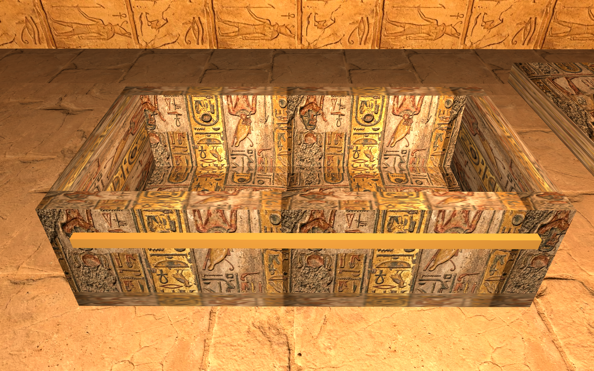 |

## Features

- Dynamic directional, point, and spotlight lighting
- Phong and Gouraud shading toggle
- Procedural ocean waves using Bezier displacement
- Recursive fractal desert trees
- Multi-viewport rendering (Top, Front, Isometric, Perspective)
- Interactive runtime controls and teleport shortcuts

## Build

```bash
make
./main
```

## Controls

See [docs/keyboard_shortcuts.md](docs/keyboard_shortcuts.md) for the full interactive control map.

## Notes

Implementation details are documented in [docs/implementation_summary.md](docs/implementation_summary.md).
